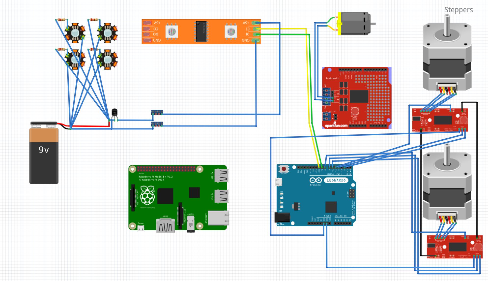

#Holobot

The HoloLens robotics in coordination with the Windows Maker team will demonstrate:
- Raspberry Pi 2 running Windows 10 Core.
- Pairing a Raspberry Pi 2 with an Arduino
- Partnering a robot with holographic information display and control solutions. 
- Navigation and obstacle avoidance leveraging scene mapping via external sensor

##Requirements
- Clear field is available of at least 10'x10'
- Robot has tracking markers which can be seen despite stage lights
- Robot can turn around its center
- Robot can drive in a straight line
- Robot can drive with centimeter accuracy
- Robot has RGB pixel displays which can be controlled via Holographic control panel
- Robot is larger than 12"x12"x12", but no bigger than 18"x18"x12"
  * Needs to be seen by the audience
  * Cannot be too big that the Hololens cannot see the whole bot
  * Top needs to be short and flat so the tracking beacons can be viewed
- Robot needs to be able to move fast enough to transverse the field in less than 30 seconds.
- Robot needs to be controlled at all times
- Robot needs to be battery powered
- Robot needs to have a battery which lasts for 20 minutes idle and 30 minutes driving time.
  * 20 minutes from the time that we make the unit hot until it is activated for demo
  * 30 minutes of active drive time for the duration of the demo.

##BOM
**Frame**
* [MakeBlock](http://MakeBlock.cc) Lab Kit
* [3D Printed Left Wheel](Parts/holobot_wheel_left.stl)
* [3D Printed Right Wheel](Parts/holobot_wheel_right.stl)
* M8x1.25mm threaded rod for axle
* M8 lock bolts
* M8 washers
* Standard Caster
* Machined Plexiglas mount (3D printable mount coming soon)
* [MakeBlock](http://MakeBlock.cc) long bars (cut down to width)

**Electronics**
* [Raspberry Pi 2](Raspberrypi.org)
* [Arduino Leonardo](http://store.arduino.cc/product/A000057)
* 2x [Big Easy Driver](https://www.sparkfun.com/products/12859)
* [UBEC DC/DC Step Down 5 volt regulator](https://www.adafruit.com/products/1385)
* [Sparkfun Motor Shield](https://www.sparkfun.com/products/9815)
* [Adafruit RGB LED Strip](http://www.adafruit.com/product/306)
* 2x Green 1 Watt Luxeon LEDs and mount
* 2x Red 1 Watt Luxeon LEDs and mount
* 4x 20 ohm 2 watt resistors

**Miscellaneous**
* Wire Ribbon
* Arduino Headers
* Male Headers
* Female headers
* 2x Bus Bar
* Screw terminals configured for 5v (+ & -) bus bar
* 8.4v 3300mAh Battery Pack
* Charger for battery pack
* Anderson Power Poles
* Standoffs & screws
* 2x Short mini-USB cables
* 2x Mini Automotive Fuse holder
* 2x 5 amp mini fuse
* Windows 10 Core supported Wireless adapter
* 4 pin connectors
* 2 pin connectors
* Foam PVC for the floor of the robot, where the electronics are mounted

##Frame
The Holobot Frame is constructed using [MakeBlock](http://MakeBlock.cc) components. 

[Customize the wheels using Autodesk Fusion 360](http://a360.co/1NZI9nd)

<iframe src="https://myhub.autodesk360.com/ue29a4fc5/shares/public/SHabee1QT1a327cf2b7a395d64d9ac759a9b?mode=embed" width="640" height="480" allowfullscreen="true" webkitallowfullscreen="true" mozallowfullscreen="true"  frameborder="0"></iframe>

##Electronics

### Arduino Wiring
* 2    -   Right Motor Direction
* 3    -   Neck Motor PWM
* 4    -   Right Motor Step
* 5    -   Right Motor Enable
* 6    -   Left Motor Direction
* 7    -   Left Motor Step
* 8    -   Left Motor Enable
* 9    -   LED Strip Data Pin
* 10   -   LED Strip Clock Pin
* 12   -   Neck Direction

##Software Stack

**HoloLens Application**
The HoloLens Experiences team will be implementing the HoloLens application. It will locate the robot by name. When activated, the HoloLens application will command the robot.

**Robot Application**
The Robot is built using the Universal Windows Application Platform in C#. It is a headless background task configured to launch shortly after boot.

**HTTP Command Handler**
At application start, a socket is created at port 3000 which accepts connections. On connection, http headers are manually processed and query parameters broken up and interpreted. The commands are then dispatched to the Robot object

**Robot Object**
The Robot object takes raw commands and interprets them in the context of the robot - with understanding of it's physical geometry.

**Arduino Object**
The Arduino object will manage the connection and send commands using Firmata.

##Command structure
Commands are HTTP web requests of the form:
- `bot?cmd=<COMMAND>;<COMMAND_PARAM>;<COMMAND_PARAM>`
 
Responses will be of the form:
- JSON data structure
 
##Command list
- `stop`
  * Description: All stop (full motion reset)
  * Response: {success="<ok, ERROR_CODE>"}
- `status`
  * Description: Reports current command and percent of way through
  * Response: {command="<ACTIVE_COMMAND>", percent="<0-100>"}
- `move`
  * Description: Translate forward specified distance (negative values are backwards)
  * Required params:  dst - distance (in cm)
  * Response: {success="<ok, ERROR_CODE>"}
- `moveLR`
  * Description: Translate forward specified distance, per wheel (negative values are backwards)
  * Required params:  dstL - distance (in cm) for left wheel, dstR - distance (in cm) for right wheel
  * Response: {success="<ok, ERROR_CODE>"}
- `rotate`
  * Description: Rotate right specified degrees (negative values are supported for left turns)
  * Required Params: deg - degrees
  * Response: {success="<ok, ERROR_CODE>"}
- `armExtend`
  * Description: Extend arm
  * Response: {success="<ok, ERROR_CODE>"}
- `armRetract`
  * Description: Extend arm
  * Response: {success="<ok, ERROR_CODE>"}
- `getBattery`
  * Description: Reports battery level
  * Response: {success="<ok, ERROR_CODE>", percent="<0-100>"}
- `getWiFi`
  * Description: Reports wifi signal strength
  * Response: {success="<ok, ERROR_CODE>", percent="<0-100>"}
- `getCompass`
  * Description: Reports rotational direction from north (in degrees)
  * Response: {success="<ok, ERROR_CODE>", angle="<0-360>"}
 
##Error codes
- `error - General error` -- (no specific information to give)
- `error_invalid_request` -- Invalid request
- `error_system_state` -- System/bot is in a bad state, cannot complete request right now
 
##Examples
- `bot?cmd=move;dst=100` -- Bot to go forwards 100 cm
- `bot?cmd=rotate;deg=90` -- Bot rotate right 90 (degrees in place)

## Trivia
* We built 5 robots for the //build demo. Originally we were going to have two, which we named Hansel and Gretel. To mitigate risk, we decided to make a total of 5 robots - we named the rest following the theme - Crumb, Ginger and Candy. [Candy](https://www.youtube.com/watch?v=r1PaAWvygQk) was built in Timelapse.
* We started the project about 4 weeks before the demo.
* IoT Core on Raspberry Pi GPIO was not functioning at the time we started the demo, so we used an Arduino for the motors
* We originally were going to have the robot do a 'selfie', with an extending boom built using an Automotive antenna.
* The neck was articulated with a motor - but we didn't use it in the demo becaue it was slow for the animation.
* The caster caused us lots of grief - it would 'kick' when turning throwing off the tracking.
* We rebuilt the lighting system just a few days before the demo because the overhead lights washed out our original system. However, we didn't want the lights to brown out the CPU, which is why it is on an independent circuit.
* The mechanics were designed by [Bert](https://github.com/JustAddWires). He also machined the wheels, axle and caster mount. 

