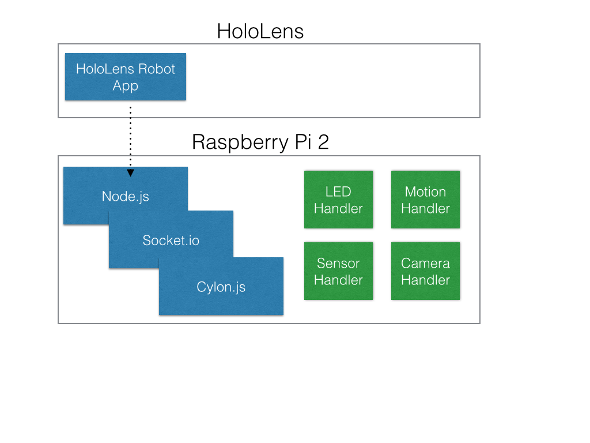

#holobot

The HoloLens robotics demonstration at //build will attempt to show:
- Navigation of a robot by pointing to a destination.
- Raspberry Pi running Windows 10 Core.

##Requirements
- Clear field is available(10'x10')
- Floor is not tile or wood
- Robot has AR markers which can be seen despite stage lights
- Robot can turn around its centroid
- Robot can drive in a straight line
- Robot can drive with centimeter accuracy
- Robot can extend a 'boom' with a camera pointing towards itself - for a selfie.
- Robot can post photos from boom to twitter
- Robot has RGB pixel displays which can be controlled via Holographic control panel
- Robot is larger than 12"x12"x12", but no bigger than 18"x18"x12"
  * Needs to be seen by the audience
  * Cannot be too big that the lens cannot see the whole bot
  * Top needs to be short and flat so the AR beacons can be viewed
- Robot needs to be able to move fast enough to transverse the field in less than 30 seconds.
- Robot needs to be controlled at all times
- Robot needs to be battery powered
- Robot needs to have a battery which lasts for 20 minutes idle and 30 minutes driving time.
  * 20 minutes from the time that we make the unit hot until it is activated for demo
  * 30 minutes of active drive time for the duration of the demo.
- Robot is able to query the battery lifetime
- Robot is able to report battery to the holo display.

##Electronics

##Software Stack

**HoloLens Application**
The HoloLens Experiences team will be implementing the HoloLens application. It will locate the robot by name. When activated, the HoloLens application will command the robot.

**Robot Application**
The Robot will be implemented using Cylon.js over Socket.io in Node.js. Each subsystem will be implemented as a cylon device and exposed through the socket.io api.

**LED Handler**
The LED handler will expose a service which controls the RGB strip given a constant RGB color.

**Motion Handler**
The motion handler exposes high level APIs for control including:
- `rotate(deg)`
  * Rotates the unit -180.00 to 180.00
- `move(centimeters)`
  * Moves forward or backward specified number of centimeters
- `velocity(left/right, 0  1)`
  * Applies a multiplier to the left or right velocity to allow mid stream course correction from the HoloLens application
- `Stop`
  * All stop. Also resets velocity

**Sensor Handler**
Allows application to query sensor states:
- `getBattery`
  * Returns battery level
- `getCompass`
  * Returns North in degrees

**Camera Handler**
Controls the 'selfie' camera
- `extend`
  * Extends the selfie boom
- `retract`
  * Retracts the selfie boom
- `capture`
  * captures from the selfie camera to local file
- `post`
  * posts captured selfie to a twitter feed with hashtag
  * need: configuration options for the twitter account

##Command structure
Commands will be coming in as HTTP web requests of the form:
- `bot?cmd=<COMMAND>;<COMMAND_PARAM>;<COMMAND_PARAM>`
 
Responses will be of the form:
- JSON data structure
 
##Command list
- `stop`
  * Description: All stop (full motion reset)
  * Response: {success="<ok, ERROR_CODE>"}
- `status`
  * Description: Reports current command and percent of way through
  * Response: {command="<ACTIVE_COMMAND>", percent="<0-100>"}
- `move`
  * Description: Translate forward specified distance (negative values are backwards)
  * Required params:  dst - distance (in cm)
  * Response: {success="<ok, ERROR_CODE>"}
- `moveLR`
  * Description: Translate forward specified distance, per wheel (negative values are backwards)
  * Required params:  dstL - distance (in cm) for left wheel, dstR - distance (in cm) for right wheel
  * Response: {success="<ok, ERROR_CODE>"}
- `rotate`
  * Description: Rotate right specified degrees (negative values are supported for left turns)
  * Required Params: deg - degrees
  * Response: {success="<ok, ERROR_CODE>"}
- `armExtend`
  * Description: Extend arm
  * Response: {success="<ok, ERROR_CODE>"}
- `armRetract`
  * Description: Extend arm
  * Response: {success="<ok, ERROR_CODE>"}
- `camCapture`
  * Description: Capture an image
  * Response: {success="<ok, ERROR_CODE>"}
- `getBattery`
  * Description: Reports battery level
  * Response: {success="<ok, ERROR_CODE>", percent="<0-100>"}
- `getWiFi`
  * Description: Reports wifi signal strength
  * Response: {success="<ok, ERROR_CODE>", percent="<0-100>"}
- `getCompass`
  * Description: Reports rotational direction from north (in degrees)
  * Response: {success="<ok, ERROR_CODE>", angle="<0-360>"}
 
##Error codes
- `error - General error` -- (no specific information to give)
- `error_invalid_request` -- Invalid request
- `error_system_state` -- System/bot is in a bad state, cannot complete request right now
 
##Examples
- `bot?cmd=move;dst=100` -- Bot to go forwards 100 cm
- `bot?cmd=rotate;deg=90` -- Bot rotate right 90 (degrees in place)

